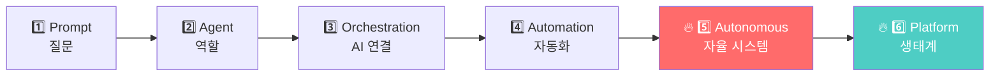
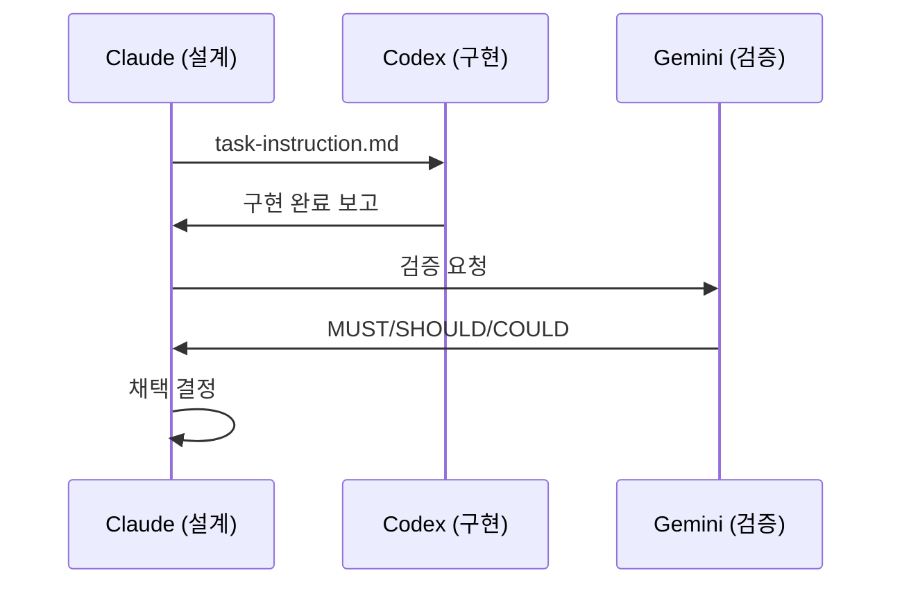
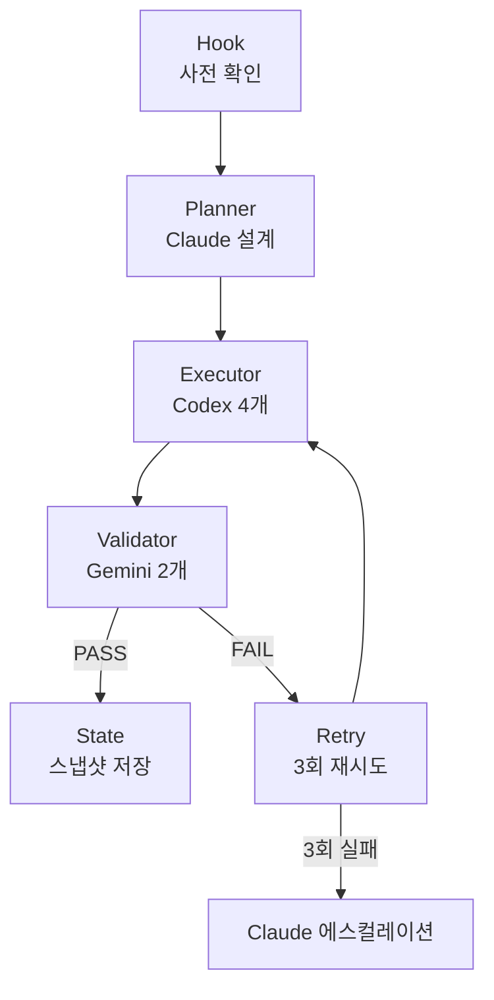
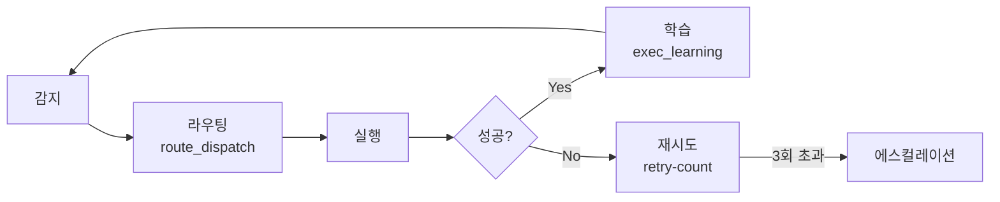

## Context
- Gamma MCP:  !`claude mcp list 2>/dev/null | grep -i gamma   && echo OK || echo 없음`
- Canva MCP:  !`claude mcp list 2>/dev/null | grep -i canva   && echo OK || echo 없음`
- Mermaid MCP:!`claude mcp list 2>/dev/null | grep -i mermaid && echo OK || echo 없음`

## Your task

파이프라인: **Claude 구조 설계 → Gamma/Canva 슬라이드 → Mermaid 다이어그램 → Figma 완성**

---

### Step 1 — Hook (사전 확인)
MCP 상태 확인. 없으면 `/install-mcp` 안내.

---

### Step 2 — Planner: 슬라이드 구조 설계

**제목:** AI 시스템 진화 6단계 — Prompt에서 Platform까지

**슬라이드 목록 (15장):**

```
슬라이드 1: 표지
  제목: AI 시스템 진화 6단계
  부제: Prompt에서 Platform까지 — 차원이 바뀌는 순간들
  시각: 계단형 상승 그래프 (1→6단계)

슬라이드 2: 목차 / 전체 로드맵
  6단계 한눈에 보기 (아이콘 + 한 줄 설명)
  시각: Mermaid flowchart 가로형

슬라이드 3: 1단계 — Prompt (프롬프트)
  "그냥 질문하는 단계"
  핵심: 단일 입력 → 단일 출력 / 기억 없음 / 역할 없음 / 자동화 없음
  예시: "코드 짜줘" / "PPT 만들어줘"
  시각: 화살표 1개 (입력 → 출력)

슬라이드 4: 2단계 — Agent (에이전트)
  "역할을 부여하는 단계"
  핵심: 역할 기반 동작 / Context 유지 / 특정 목적 수행
  예시: "너는 백엔드 개발자야" / "너는 PPT 전문가야"
  시각: 역할 박스 + context 흐름

슬라이드 5: 3단계 — Orchestration (오케스트레이션)
  "여러 AI를 연결하는 단계"
  핵심: Claude + Codex + Gemini / 역할 분리 / 작업 분배
  예시: Claude→설계 / Codex→코드 / Gemini→검증
  시각: Mermaid sequence diagram (3 AI 핸드오프)

슬라이드 6: 3단계 심화 — 오케스트레이션 파이프라인
  Hook → Planner → Executor → Validator → State → Retry
  시각: Mermaid flowchart (6단계 파이프라인)

슬라이드 7: 4단계 — Automation (자동화)
  "사람이 안 끼어도 돌아가는 단계"
  핵심: Hook / Plugin / Command / MCP
  예시: /orc-start / 자동 실행 / 이벤트 기반 트리거
  시각: 자동화 트리거 다이어그램

슬라이드 8: 4단계 심화 — 현재 구현 상태
  plugins/ 13개 / commands/ 21개 / hooks/ 9개
  시각: 플러그인 구조 트리

슬라이드 9: 🔥 5단계 — Autonomous System (자율 시스템)
  "여기서 차원이 바뀐다"
  핵심 4요소: 라우팅 / 실패 판단 / 재시도 / 상태 저장
  시각: 순환 자율 루프 다이어그램

슬라이드 10: 5단계 심화 — 4요소 상세
  라우팅: route_dispatch (codex/gemini/claude 자동 배분)
  실패 판단: retry-count.json
  재시도: 3회 → 에스컬레이션
  상태 저장: session-snapshot.md + learning JSON
  시각: 4분할 박스

슬라이드 11: 🔥 6단계 — Platform (플랫폼)
  "시스템이 아니라 생태계"
  핵심: 여러 workflow / 여러 사용자 / 권한·비용·로그 관리 / API·UI 제공 / 서비스화
  예시: SaaS / 내부 AI 플랫폼 / 팀 단위 운영
  시각: 생태계 구조도

슬라이드 12: 1→6단계 비교표
  | 단계 | 핵심 키워드 | 자동화 | 자율성 | 확장성 |
  시각: 비교 매트릭스 (색상 그라데이션)

슬라이드 13: 현재 위치와 로드맵
  "지금 이 킷은 어디에 있나?"
  현재: 4단계(자동화) 완성 → 5단계(자율) 진입 중
  로드맵: 5단계 완성 → 6단계(플랫폼) 목표
  시각: 진행 바 + 로드맵 타임라인

슬라이드 14: 구현 전략
  5단계 달성을 위한 남은 과제:
  - 자율 라우팅 고도화 (route_dispatch)
  - 실패 자동 복구 (retry-count.json 활용)
  - 학습 루프 (exec_learning 활용)
  시각: 체크리스트

슬라이드 15: 마무리
  "AI는 도구가 아니라 팀이다"
  6단계 진화 요약 한 줄씩
  시각: 계단형 완성도 그래프
```

---

### Step 3 — Executor: Mermaid 다이어그램 생성

**슬라이드 2 — 전체 로드맵:**


**슬라이드 5 — 오케스트레이션 핸드오프:**


**슬라이드 6 — 파이프라인:**


**슬라이드 9 — 자율 루프:**


---

### Step 4 — Executor: 슬라이드 생성

**Gamma OK:**
```
mcp__claude_ai_Gamma__generate 호출
  prompt: "AI 시스템 진화 6단계 프레젠테이션.
           [위 슬라이드 구조 전달]
           스타일: 다크 테마, 미래지향적, 기술적"
```

**Canva OK (Gamma 없을 때):**
```
mcp__claude_ai_Canva__generate-design 호출
  type: presentation
  slides: 15
  theme: tech-dark
```

---

### Step 5 — Validator
- 15장 슬라이드 생성 확인
- 다이어그램 4개 렌더링 확인
- 6단계 모두 포함 여부 확인

---

### Step 6 — State 저장
```
docs/YYYY-MM-DD/presentations/ai-system-6stages.md
```

---

### Step 7 — 결과 보고
| 항목 | 결과 |
|------|------|
| 슬라이드 수 | 15장 |
| 다이어그램 | 4개 (Mermaid) |
| 생성 도구 | Gamma / Canva |
| 저장 경로 | docs/YYYY-MM-DD/ |
| 링크 | [열기](URL) |
