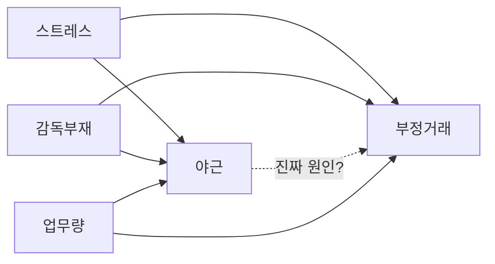

# Causal AI — 인과 추론

## 핵심 통찰

```text
상관관계 (correlation) ≠ 인과관계 (causation)

예) "야근 직원의 부정거래 비율이 높다"
    → 야근이 부정거래 원인? (인과)
    → 아니면 부정거래 직원이 숨기려고 야근? (역인과)
    → 또는 둘 다 다른 원인 (감독 부재)?

단순 상관 분석은 거짓양성·역인과 위험.
인과 추론으로만 진짜 원인 식별 가능.
```

## Pearl 인과 계층 (Ladder of Causation)

| 단계 | 질문 | 예 |
|---|---|---|
| **① 관찰 (Association)** | P(Y\|X) — "X 일 때 Y 가 일어나는가?" | 야근 + 부정거래 동시 발생 빈도 |
| **② 개입 (Intervention)** | P(Y\|do(X)) — "X 를 강제하면 Y 가 바뀌나?" | 야근 의무화하면 부정거래 늘어? |
| **③ 반사실 (Counterfactual)** | P(Y_x'\|X=x, Y=y) — "X 가 다르면 Y 가 어땠을까?" | 야근 안 했어도 이 사람이 부정 저질렀을까? |

→ 위험관리·법적 판단은 ② ③ 단계 필요. ① 단계 (단순 ML 분류) 만으론 부족.

## 도구·라이브러리

| 도구 | 회사 | 특징 |
|---|---|---|
| **DoWhy** | Microsoft | Python, 4단계 (modeling·identification·estimation·refutation) |
| **Causica** | Microsoft | Deep Learning 기반 인과 |
| **EconML** | Microsoft | 계량경제 인과 (CATE·heterogeneous effect) |
| **CausalML** | Uber | uplift 모델링 |
| **Ananke** | JHU | identification (자동 식별) |
| **pgmpy** | OSS | Probabilistic Graphical Model |

## DoWhy 4단계 워크플로우

```python
from dowhy import CausalModel
import pandas as pd

# 1. Modeling — 인과 그래프 정의
data = pd.read_csv('employee_behavior.csv')
model = CausalModel(
    data=data,
    treatment='overtime_hours',     # 원인 후보
    outcome='fraud_score',          # 결과
    common_causes=['supervisor_absent', 'workload'],  # 공통 원인
    graph='digraph { supervisor_absent -> overtime_hours; supervisor_absent -> fraud_score; overtime_hours -> fraud_score; workload -> overtime_hours; workload -> fraud_score; }'
)

# 2. Identification — 식별 가능한가?
identified_estimand = model.identify_effect()

# 3. Estimation — 인과 효과 추정
estimate = model.estimate_effect(
    identified_estimand,
    method_name='backdoor.propensity_score_matching'
)
print(f"야근 → 부정 인과 효과: {estimate.value}")

# 4. Refutation — 추정이 robust 한가?
refute = model.refute_estimate(
    identified_estimand,
    estimate,
    method_name='random_common_cause'
)
print(f"가짜 변수 추가 시 효과 변화: {refute}")
```

## 행동위험 인과 그래프 예제



→ DoWhy 가 do-calculus 로 야근의 진짜 인과 효과 분리.

## 우리 솔루션 통합 (신규 구축)

```bash
# 1. DoWhy 설치
pip install dowhy pandas networkx

# 2. plugin 신설
plugins/ai_causal/
├── plugin.json
├── README.md
├── skills/
│   ├── causal-discovery.md    # 인과 그래프 자동 발견
│   ├── causal-estimation.md   # 인과 효과 추정
│   └── counterfactual.md      # 반사실 분석
└── scripts/
    ├── run_dowhy.py
    ├── causal_graph_builder.py
    └── refutation_tests.py
```

## 부서 적용 사례

| 사례 | 인과 질문 |
|---|---|
| **내부회계 분식** | 감독 부재 → 분식 인과 효과? (개입) |
| **이직 예측** | 어떤 행동 패턴이 이직 인과 신호? (반사실) |
| **사고·중대재해** | 어떤 요인이 사고를 일으켰나? (DoWhy backdoor) |
| **AI CCTV 알람** | 시간대 + 위치 → 침입 인과? 또는 다른 공통 원인? |
| **사이버보안 침해** | 패치 지연 → 침해 인과 효과? |

## AI Risk Lighthouse 카테고리 #2 (15%)

| 점검 항목 | 검사 |
|---|---|
| 위험점수에 인과 설명 있는가? | 단순 상관관계만이면 -5점 |
| DoWhy·Causica 적용? | 적용 시 +10 |
| 반사실 분석 가능? | "다른 행동 했으면 어땠을까" 답 가능 |
| 인과 그래프 명시? | DAG 문서화 + 도메인 전문가 검증 |
| Refutation test 통과? | random_common_cause·placebo 등 |

## 트리거

- "Causal AI", "인과 추론"
- "원인 분석", "왜 그런가"
- "DoWhy", "Pearl 인과"
- "단순 상관관계 X"
- "반사실", "Counterfactual"

## 참조

- Pearl 2018, "The Book of Why"
- Microsoft DoWhy: https://github.com/py-why/dowhy
- `ai-risk-lighthouse.md` § Causal AI 카테고리
- `solution-capability-audit.md` # 3 항목 (현재 ❌, 구축 후 ✅)
